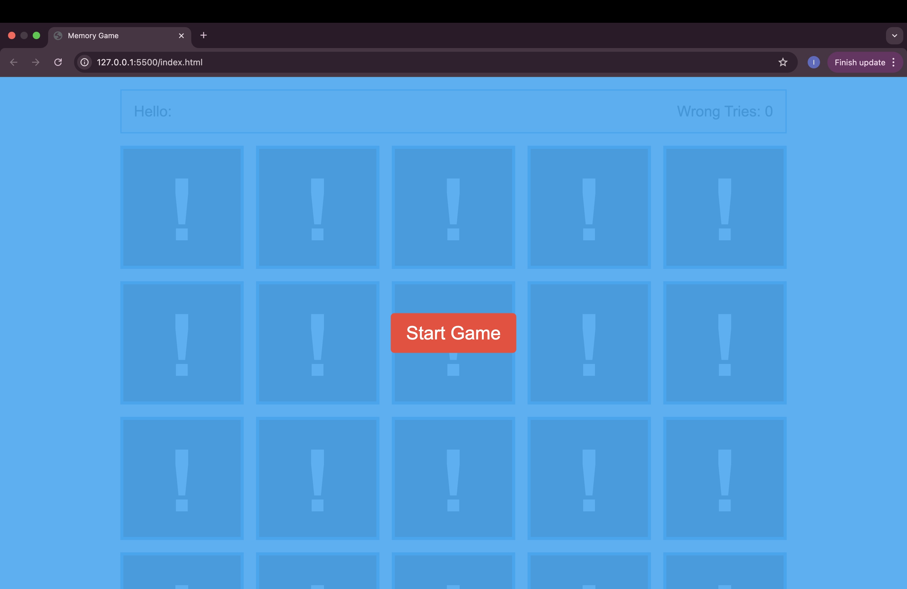
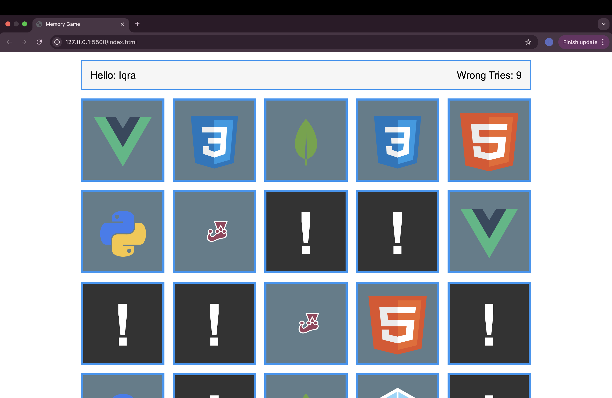

Reverse Puzzle is a web-based logic game built with HTML, CSS, and JavaScript. The goal is to solve the puzzle by reversing the correct sequence of tiles within the least number of moves.

Technologies Used
• HTML – for structure
• CSS – for styling and layout
• JavaScript – for game logic and interactivity

## Screenshots

### Screenshot 1

### Screenshot 2

